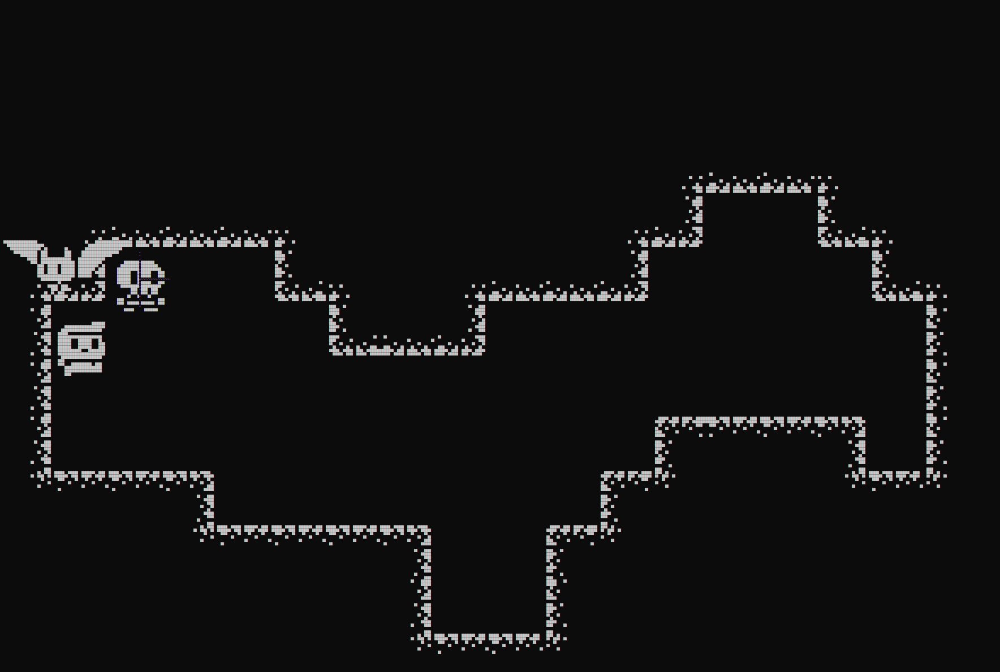

# 🕹️ Monochrome Engine


A custom, high-performance 2D monochrome ASCII rendering and game engine built entirely from scratch in pure C#. This project bypasses heavy commercial frameworks to explore low-level software architecture, game loop physics, custom rendering pipelines, and modular design directly within the system console.

---

## 🚀 Key Features

* **Proprietary Software Renderer:** A modular rendering pipeline driven by custom interfaces (`IRenderer`) that handles screen updates and text-based graphics buffer manipulation.
* **Custom 2D Physics & Collision Engine:** Built-in geometric collision detection supporting bounding boxes (`BoxCollider2D`), bounding circles (`CircleCollider2D`), and custom raycasting math (`Ray.cs`).
* **Decoupled Architecture:** Built on strict Separation of Concerns. Features explicit abstractions for engine loops (`IUpdatable`), asset parsing (`SpritesLoaderSystem`), and raw input processing.
* **Flexible Text Animation Framework:** Includes specialized state-based components (`BaseAnimator`, `TextAnimator`) for processing real-time procedural ASCII animations.
* **Extensible Entity Hierarchy:** Formed around base architectural classes (`BaseGameObject`, `BaseCreature`), allowing rapid development of complex AI, entities, and gameplay mechanics.

---

<p align="center">
  
</p>

## 🛠️ Project Architecture

The codebase implements a clean, intuitive structure separating core engine systems, mathematics, and gameplay entities:

```text
MonochromeEngine/
├── Anim/                 # Animation framework (BaseAnimator, TextAnimator)
├── Collisions/           # High-level physics collision management
├── Creatures/            # Living entities logic (BaseCreature, Hero)
├── Engine/               # Core execution systems
│   ├── Collider/         # 2D Collision geometry (Box, Circle, Base Collider)
│   └── Levels/           # Environment and level-loading subsystems
│   ├── Input.cs          # Raw input reading abstraction
│   ├── IRenderer.cs      # Core rendering interface
│   ├── IUpdatable.cs     # Game loop integration interface
│   ├── MonoRenderer.cs   # Concrete console buffer renderer
│   ├── Ray.cs            # Custom raycasting algorithms
│   ├── Update.cs         # Delta-time and engine tick manager
│   └── Vector2.cs        # Custom math utility for 2D coordinates
├── Sprites/              # ASCII sprite sub-sheets (Characters, Enemies, Fonts, Ground, Items)
├── UI/                   # Text-based interface layout components
└── Utils/                # Resource management (SpritesLoaderSystem, Map, Sprite)

